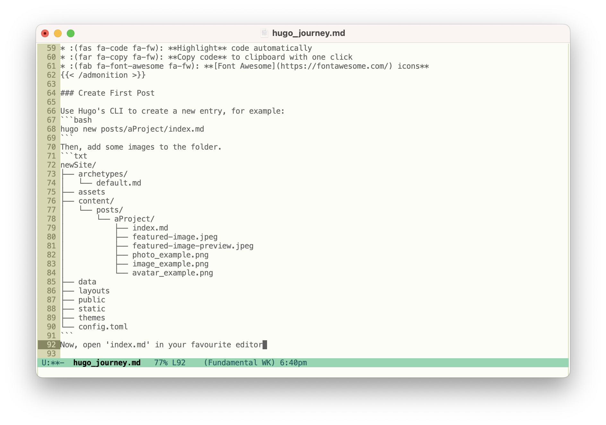

<!--more-->
## Class of '23
It was time to update my professional profile, resume, and, most importantly, my portfolio. The information design program encouraged students to use Adobe's Portfolio in preparation for their internships during their 2nd year of studies. It was time for a change.


While the decision to use Adobe's portfolio has many advantages, it comes with a few significant drawbacks:
1. **Price tag** is the major deterrent, specifically the push to an annual subscription model.
1. **Formulaic offerings** which look great but offer little in terms of customizability.
1. **Uninspired user experience** that offers tedious formatting options and leaves me frustrated.

For the price, I find Adobe's offering to be prohibitively restrictive while simultaneously including far more than my work requires. 


## Static Site Generators
According to Jamstack,  serve a website from a prebuilt set of files within a repository, such as git. There are many flavours of SSGs, each with their own set of features and capabilities. The most popular of which are Gatsby, Jekyll, 11ty, Next.js, Astro, Docusaurus, and Hugo.

### Exploring My Options
Despite my technical inclinations, I wanted a portfolio solution which required minimal configuration and dependencies. I experimented with a few popular choices, initially Gatsby and then Eleventy, but neither platform felt succinct. It was a series of incompatibilities and redundant workarounds which ultimately discouraged further experimentation. **I wanted simplicity.** 


 is a static site generator written in Go. Beyond its blazing fast performance, I chose Hugo because it offers:
1. **Headless CMS** allows me to write entries in plain text instead of within Adobe's content management system.
1. **Markdown** streamlines page content and metadata.
1. **Shortcodes** for JavaScript libraries like image galleries.
1. **TOML** language enables simple configuration.
1. **Instant previews** save time and aid troubleshooting.




## Site Building 
The process of building the portfolio site was split between two workflows: (1) **create the site** and (2) **format existing content**.

### Create New Site
I followed the official  to install Hugo, create a new site, acquire a  and run the included development server to test that everything was working as expected.


[:(far fa-kiss-wink-heart fa-fw): LoveIt](https://github.com/dillonzq/LoveIt) is a theme for [Hugo](https://gohugo.io/) developed by . It is based on the original [LeaveIt Theme](https://github.com/liuzc/LeaveIt) and [KeepIt Theme.](https://github.com/Fastbyte01/KeepIt)



I chose this theme for its simplicity and functionality, specifically:
* :(fas fa-tachometer-alt fa-fw): **CDN** for third-party libraries supported
* :(fas fa-cloud-download-alt fa-fw): **Lazy Load** by [lazysizes](https://github.com/aFarkas/lazysizes) to auto-resize images
* :(far fa-images fa-fw): **Images gallery** supported by [lightGallery](https://github.com/sachinchoolur/lightgallery)
* :(fas fa-mobile-screen fa-fw): **Responsive** layout
* :(fas fa-circle-half-stroke fa-rotate-180 fa-fw): **Light/Dark** mode
* :(fas fa-search fa-fw): **Search** supported by [Lunr.js](https://lunrjs.com/) or [algolia](https://www.algolia.com/)
* :(fas fa-square-root-alt fa-fw): **Mathematical formula** supported by [$\KaTeX$](https://katex.org/)
* :(fas fa-project-diagram fa-fw): **Diagrams** shortcode supported by [mermaid](https://github.com/mermaid-js/mermaid)
* :(fas fa-chart-pie fa-fw): **Data visualization** shortcode supported by [ECharts](https://echarts.apache.org/)
* :(fas fa-note-sticky fa-fw): **Admonitions** shortcode
* :(fab fa-css3 fa-fw): **Custom style** shortcode
* :(fab fa-js-square fa-fw): **Custom script** shortcode
* :(fas fa-code fa-fw): **Highlight** code automatically
* :(far fa-copy fa-fw): **Copy code** to clipboard with one click
* :(fab fa-font-awesome fa-fw): **[Font Awesome](https://fontawesome.com/) icons**

The theme also has great 

### Create New Post

Use Hugo's CLI to create a new entry, 'aProject' for example: 
```bash
hugo new posts/aProject/index.md
```
Then, add some images to the new 'aProject' directory.
```txt
newSite/
├── archetypes/
│   └── default.md
├── assets
├── content/
│   └── posts/
│       └── aProject/
│           ├── index.md
│           ├── featured-image.jpeg
│           ├── featured-image-preview.jpeg
│           └── image.png
├── data
├── layouts
├── public
├── static
├── themes
└── config.toml
```
This utilizes Hugo's  function which allows simple organization and local file references, such as images.

For example:

```markdown

```
Will be rendered as:: 


### (re)Format Content
While future entries will utilize built in diagrams, charts, and formula, the bulk of my previous work exists as physical documents, either .docx or .pdf files. Therefore, it was important to consider how the scale and device viewport transforms these documents as components within a responsive webpage.

 While not an ideal manner to demonstrate every aspect of a project, I chose to export PNG images for .docx files because: 
1. images **remove requirements** of propriety software, i.e. Microsoft Word.
1. images **avoid the tedium** of downloading each document, such as a .PDF
1. images are **responsive** 

The functionality of  is superb for images as documents because it enables a more tactile, document-like experience.

For example, zoom and pan functionality enables a dynamic viewport at scale, and the ability to flip through a gallery like the pages of a book, providing a user experience more resonant to the documents in use.





## Deployment

 provides a free and simple deployment solution, all that is required is that you manually link a git repo to their service.

To make a change, such as publish a new post, simply push the changes to a github repo, and, voila! Netlify builds my site, checking for errors in the process, and publishes the directory to my domain.    

For example, publish this post by first building the page locally:
```bash
hugo
```

Then, proceed to push via git:
```bash
git add .
git commit -m "my new hugo post"
git push -u origin head
```
Netlify will immediately rebuild the site.




If everything was successful, the new content will be live :(fas fa-grin fa-dw):